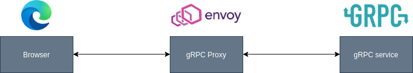

So far gRPC represents an alternative that continues gaining weight between microservices and backend-to-backend communications. It reminds me of WFC (differences aside) but open source and without the complexity added by the SOAP protocol. gRPC is built on top of HTTP/2 and Protobuf, which provides direct support for authentication, bidirectional streaming, binary serialization, cancellation, or timeouts, in addition to other features. But because web browsers do not yet fully support HTTP/2 it is not widely used as frontend-to-backend communications.

There are several solutions that seek to bring gRPC to the traditional web, some implement proxies that go between the service and the web client.



But the solution offered by the gRPC HTTP API package is hosted directly by ASP and alongside gRPC services. It is very useful when we want to offer a RESTful API using the gRPC services that we already have configured.

## Getting started

- If you don't have a project with gRPC you can create one using the Visual Studio template or directly from the console (net5) `dotnet new grpc`. Also, you can follow this [tutorial](https://docs.microsoft.com/en-us/aspnet/core/tutorials/grpc/grpc-start?view=aspnetcore-5.0&tabs=visual-studio).
- Next, add a package reference to *Microsoft.AspNetCore.Grpc.HttpApi* to the server. Register it in Startup.cs with *services.AddGrpcHttpApi()*.
- The last step is annotating your gRPC .proto file with HTTP bindings and routes.

**Note**: The annotations define how gRPC services map to the JSON request and response. You will need to add import "google/api/annotations.proto"; to the gRPC proto file and have a copy of [annotations.proto](https://github.com/aspnet/AspLabs/blob/12d388c1964c8844dcbbdcd643f8bd7c6423a4c4/src/GrpcHttpApi/sample/Proto/google/api/annotations.proto) and [http.proto](https://github.com/aspnet/AspLabs/blob/12d388c1964c8844dcbbdcd643f8bd7c6423a4c4/src/GrpcHttpApi/sample/Proto/google/api/http.proto) in your project.

After these steps, your .proto file must be like this example that I took from the official repo:

```csharp
syntax = "proto3";

import "google/api/annotations.proto";

package greet;

service Greeter {
  rpc SayHello (HelloRequest) returns (HelloReply) {
    option (google.api.http) = {
      get: "/v1/greeter/{name}"
    };
  }
  rpc SayHelloFrom (HelloRequestFrom) returns (HelloReply) {
    option (google.api.http) = {
      post: "/v1/greeter"
      body: "*"
    };
  }
}

message HelloRequest {
  string name = 1;
}

message HelloRequestFrom {
  string name = 1;
  string from = 2;
}

message HelloReply {
  string message = 1;
}
```

## Links of interest

- [Package Github](https://github.com/aspnet/AspLabs/tree/master/src/GrpcHttpApi).
- [Nuget](https://www.nuget.org/packages/Microsoft.AspNetCore.Grpc.HttpApi).
- [Author post](http://james.newtonking.com/archive/2020/03/31/introducing-grpc-http-api).
- [Official documentation](https://docs.microsoft.com/en-us/aspnet/core/grpc/httpapi?view=aspnetcore-5.0).

I have created a repository where this package is implemented and also it has: Docker, a frontend with React (using the same protos to build the models), SQL Server, and Entity Framework, you can have a look at this [link](https://github.com/jsantanders/todoapp).
